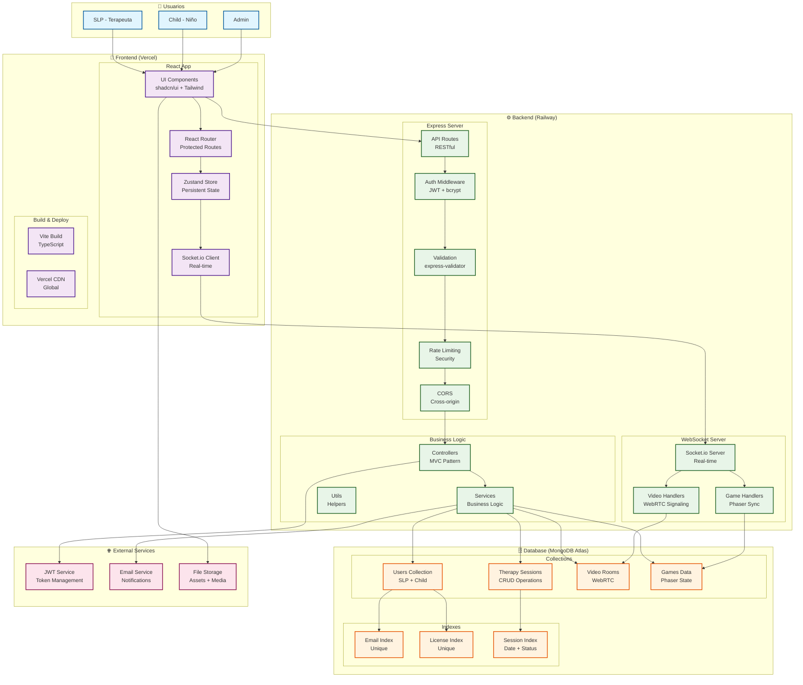
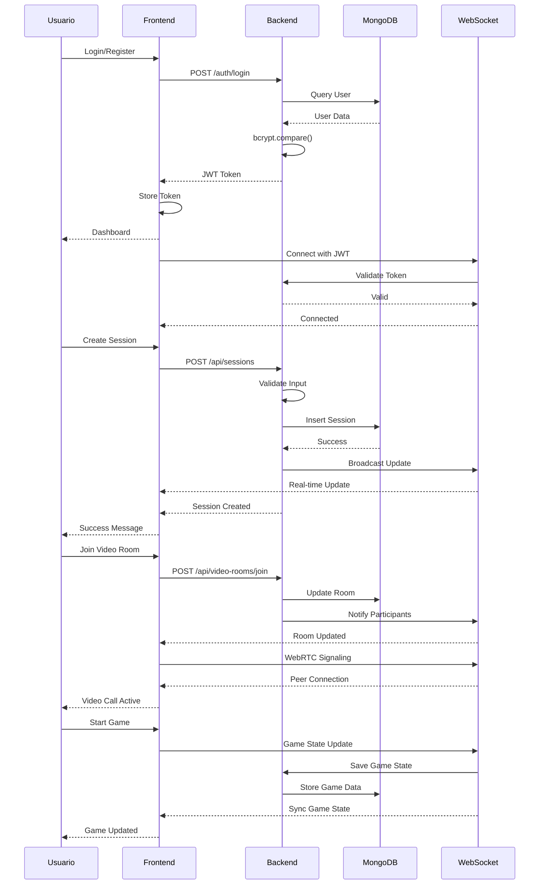
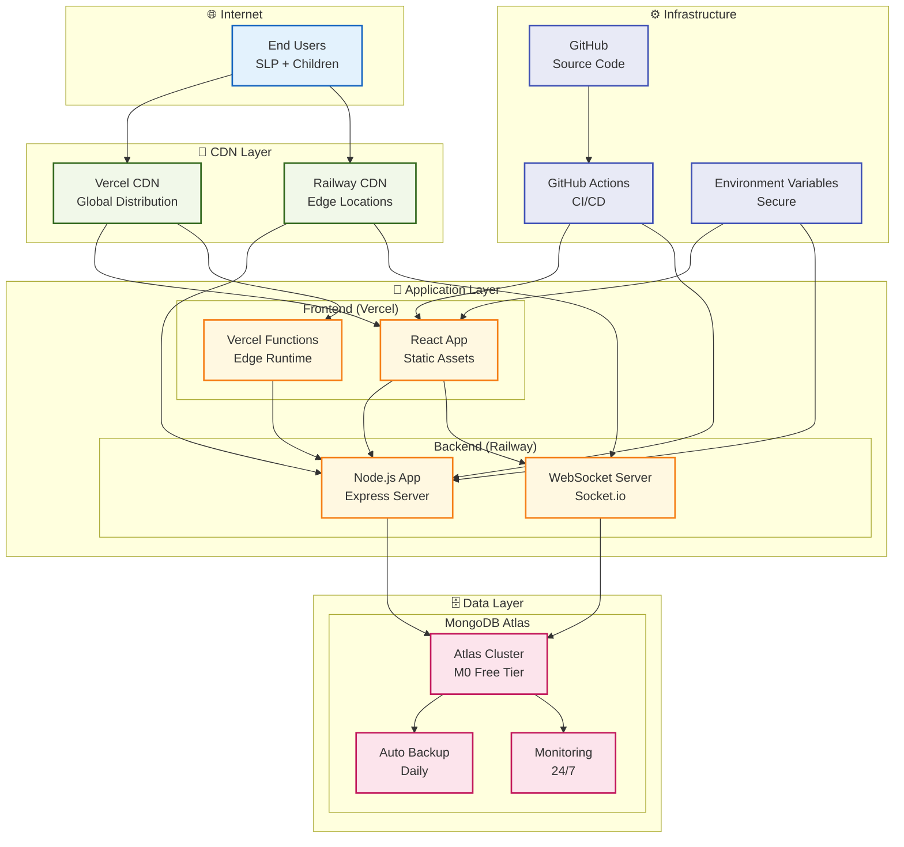
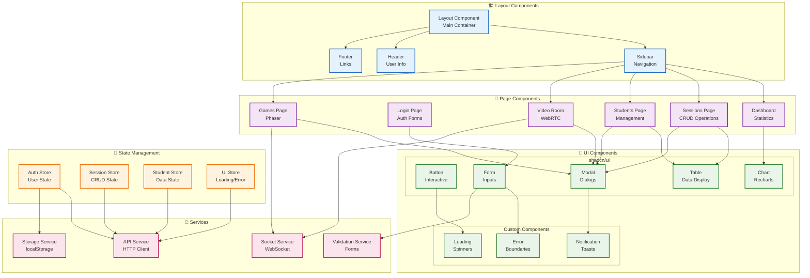
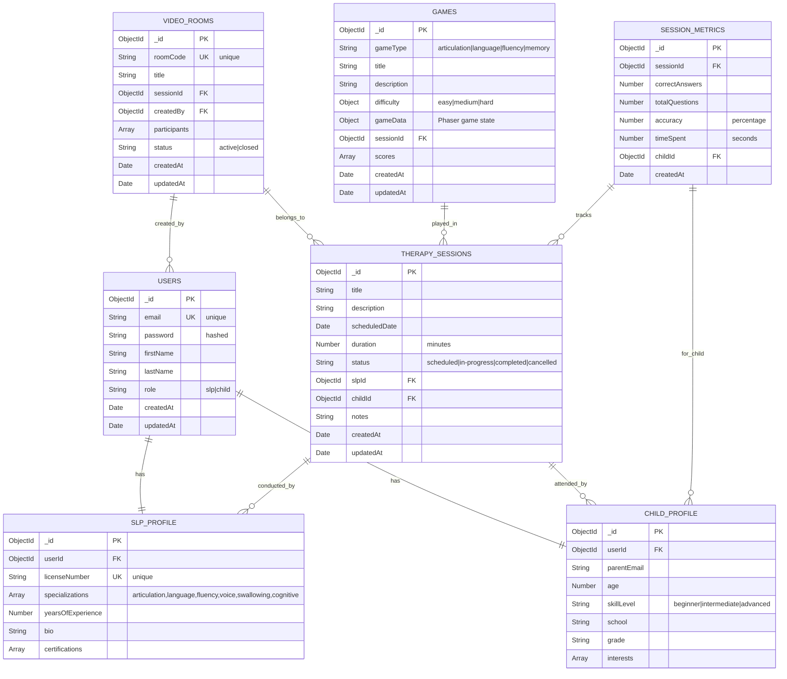
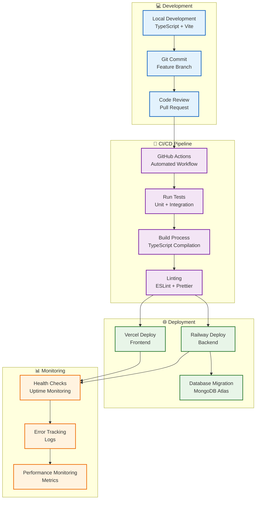

# 🏗️ DIAGRAMA DE ARQUITECTURA - PLATAFORMA DE TERAPIA DEL HABLA VIRTUAL

## 📊 **ARQUITECTURA GENERAL DEL SISTEMA**

---

## 🔄 **FLUJO DE DATOS Y COMUNICACIÓN**

---

## 🏢 **ARQUITECTURA DE DESPLIEGUE**

---

## 🔐 **ARQUITECTURA DE SEGURIDAD**

```mermaid
graph TB
    %% Client Side
    subgraph "🖥️ Client Security"
        HTTPS[HTTPS Only<br/>SSL/TLS]
        CSP[Content Security Policy<br/>XSS Prevention]
        CORS_CLIENT[CORS Headers<br/>Cross-origin]
        JWT_STORAGE[JWT Storage<br/>localStorage]
    end

    %% Network Security
    subgraph "🌐 Network Security"
        FIREWALL[Firewall<br/>Port Protection]
        RATE_LIMIT[Rate Limiting<br/>DDoS Protection]
        PROXY[Reverse Proxy<br/>Load Balancing]
    end

    %% Application Security
    subgraph "🛡️ Application Security"
        AUTH_MIDDLEWARE[Auth Middleware<br/>JWT Validation]
        INPUT_VALIDATION[Input Validation<br/>Sanitization]
        PASSWORD_HASH[Password Hashing<br/>bcrypt]
        HELMET[Helmet.js<br/>Security Headers]
    end

    %% Data Security
    subgraph "🔒 Data Security"
        ENCRYPTION[Data Encryption<br/>At Rest]
        BACKUP_ENCRYPT[Backup Encryption<br/>AES-256]
        ACCESS_CONTROL[Access Control<br/>Role-based]
        AUDIT_LOG[Audit Logging<br/>All Actions]
    end

    %% Compliance
    subgraph "📋 Compliance"
        HIPAA[HIPAA Ready<br/>Medical Standards]
        GDPR[GDPR Compliance<br/>Privacy]
        COOKIE_CONSENT[Cookie Consent<br/>User Privacy]
    end

    %% Connections
    HTTPS --> CSP
    CSP --> CORS_CLIENT
    CORS_CLIENT --> JWT_STORAGE
    
    FIREWALL --> RATE_LIMIT
    RATE_LIMIT --> PROXY
    
    AUTH_MIDDLEWARE --> INPUT_VALIDATION
    INPUT_VALIDATION --> PASSWORD_HASH
    PASSWORD_HASH --> HELMET
    
    ENCRYPTION --> BACKUP_ENCRYPT
    BACKUP_ENCRYPT --> ACCESS_CONTROL
    ACCESS_CONTROL --> AUDIT_LOG
    
    HIPAA --> GDPR
    GDPR --> COOKIE_CONSENT

    %% Styling
    classDef clientStyle fill:#e8f5e8,stroke:#2e7d32,stroke-width:2px
    classDef networkStyle fill:#fff3e0,stroke:#ef6c00,stroke-width:2px
    classDef appStyle fill:#f3e5f5,stroke:#7b1fa2,stroke-width:2px
    classDef dataStyle fill:#e1f5fe,stroke:#0277bd,stroke-width:2px
    classDef complianceStyle fill:#fce4ec,stroke:#c2185b,stroke-width:2px

    class HTTPS,CSP,CORS_CLIENT,JWT_STORAGE clientStyle
    class FIREWALL,RATE_LIMIT,PROXY networkStyle
    class AUTH_MIDDLEWARE,INPUT_VALIDATION,PASSWORD_HASH,HELMET appStyle
    class ENCRYPTION,BACKUP_ENCRYPT,ACCESS_CONTROL,AUDIT_LOG dataStyle
    class HIPAA,GDPR,COOKIE_CONSENT complianceStyle
```

---

## 📱 **ARQUITECTURA DE COMPONENTES FRONTEND**

---

## ⚙️ **ARQUITECTURA DE SERVICIOS BACKEND**

```mermaid
graph TB
    %% Entry Points
    subgraph "🚪 Entry Points"
        HTTP_SERVER[HTTP Server<br/>Express.js]
        WS_SERVER[WebSocket Server<br/>Socket.io]
    end

    %% Middleware Layer
    subgraph "🛡️ Middleware Layer"
        CORS[CORS Middleware<br/>Cross-origin]
        AUTH[Auth Middleware<br/>JWT Validation]
        VALIDATION[Validation Middleware<br/>express-validator]
        RATE_LIMIT[Rate Limit Middleware<br/>Security]
        ERROR_HANDLER[Error Handler<br/>Global]
        LOGGER[Logger Middleware<br/>Request Logging]
    end

    %% Route Layer
    subgraph "🛣️ Route Layer"
        AUTH_ROUTES[Auth Routes<br/>/auth/*]
        SESSION_ROUTES[Session Routes<br/>/api/sessions/*]
        STUDENT_ROUTES[Student Routes<br/>/api/students/*]
        VIDEO_ROUTES[Video Routes<br/>/api/video-rooms/*]
        DASHBOARD_ROUTES[Dashboard Routes<br/>/api/dashboard/*]
    end

    %% Controller Layer
    subgraph "🎮 Controller Layer"
        AUTH_CONTROLLER[Auth Controller<br/>Login/Register]
        SESSION_CONTROLLER[Session Controller<br/>CRUD Operations]
        STUDENT_CONTROLLER[Student Controller<br/>Management]
        VIDEO_CONTROLLER[Video Controller<br/>Room Management]
        DASHBOARD_CONTROLLER[Dashboard Controller<br/>Statistics]
    end

    %% Service Layer
    subgraph "🔧 Service Layer"
        USER_SERVICE[User Service<br/>Business Logic]
        SESSION_SERVICE[Session Service<br/>Session Logic]
        STUDENT_SERVICE[Student Service<br/>Student Logic]
        VIDEO_SERVICE[Video Service<br/>Room Logic]
        STATS_SERVICE[Stats Service<br/>Analytics]
    end

    %% Data Layer
    subgraph "🗄️ Data Layer"
        USER_MODEL[User Model<br/>Mongoose Schema]
        SESSION_MODEL[Session Model<br/>Mongoose Schema]
        STUDENT_MODEL[Student Model<br/>Mongoose Schema]
        VIDEO_MODEL[Video Model<br/>Mongoose Schema]
    end

    %% WebSocket Handlers
    subgraph "🔌 WebSocket Handlers"
        GAME_HANDLER[Game Handler<br/>Phaser Sync]
        VIDEO_HANDLER[Video Handler<br/>WebRTC Signaling]
        CHAT_HANDLER[Chat Handler<br/>Real-time Chat]
    end

    %% Utilities
    subgraph "🛠️ Utilities"
        JWT_UTILS[JWT Utils<br/>Token Management]
        VALIDATION_UTILS[Validation Utils<br/>Custom Validators]
        RESPONSE_UTILS[Response Utils<br/>Standard Responses]
        ERROR_UTILS[Error Utils<br/>Custom Errors]
    end

    %% Connections
    HTTP_SERVER --> CORS
    WS_SERVER --> AUTH
    
    CORS --> AUTH
    AUTH --> VALIDATION
    VALIDATION --> RATE_LIMIT
    RATE_LIMIT --> ERROR_HANDLER
    ERROR_HANDLER --> LOGGER
    
    AUTH_ROUTES --> AUTH_CONTROLLER
    SESSION_ROUTES --> SESSION_CONTROLLER
    STUDENT_ROUTES --> STUDENT_CONTROLLER
    VIDEO_ROUTES --> VIDEO_CONTROLLER
    DASHBOARD_ROUTES --> DASHBOARD_CONTROLLER
    
    AUTH_CONTROLLER --> USER_SERVICE
    SESSION_CONTROLLER --> SESSION_SERVICE
    STUDENT_CONTROLLER --> STUDENT_SERVICE
    VIDEO_CONTROLLER --> VIDEO_SERVICE
    DASHBOARD_CONTROLLER --> STATS_SERVICE
    
    USER_SERVICE --> USER_MODEL
    SESSION_SERVICE --> SESSION_MODEL
    STUDENT_SERVICE --> STUDENT_MODEL
    VIDEO_SERVICE --> VIDEO_MODEL
    
    GAME_HANDLER --> SESSION_SERVICE
    VIDEO_HANDLER --> VIDEO_SERVICE
    CHAT_HANDLER --> USER_SERVICE
    
    AUTH_CONTROLLER --> JWT_UTILS
    VALIDATION --> VALIDATION_UTILS
    AUTH_CONTROLLER --> RESPONSE_UTILS
    ERROR_HANDLER --> ERROR_UTILS

    %% Styling
    classDef entryStyle fill:#e8f5e8,stroke:#2e7d32,stroke-width:2px
    classDef middlewareStyle fill:#fff3e0,stroke:#ef6c00,stroke-width:2px
    classDef routeStyle fill:#f3e5f5,stroke:#7b1fa2,stroke-width:2px
    classDef controllerStyle fill:#e1f5fe,stroke:#0277bd,stroke-width:2px
    classDef serviceStyle fill:#fce4ec,stroke:#c2185b,stroke-width:2px
    classDef dataStyle fill:#e8eaf6,stroke:#3f51b5,stroke-width:2px
    classDef wsStyle fill:#fff8e1,stroke:#f57f17,stroke-width:2px
    classDef utilStyle fill:#f1f8e9,stroke:#33691e,stroke-width:2px

    class HTTP_SERVER,WS_SERVER entryStyle
    class CORS,AUTH,VALIDATION,RATE_LIMIT,ERROR_HANDLER,LOGGER middlewareStyle
    class AUTH_ROUTES,SESSION_ROUTES,STUDENT_ROUTES,VIDEO_ROUTES,DASHBOARD_ROUTES routeStyle
    class AUTH_CONTROLLER,SESSION_CONTROLLER,STUDENT_CONTROLLER,VIDEO_CONTROLLER,DASHBOARD_CONTROLLER controllerStyle
    class USER_SERVICE,SESSION_SERVICE,STUDENT_SERVICE,VIDEO_SERVICE,STATS_SERVICE serviceStyle
    class USER_MODEL,SESSION_MODEL,STUDENT_MODEL,VIDEO_MODEL dataStyle
    class GAME_HANDLER,VIDEO_HANDLER,CHAT_HANDLER wsStyle
    class JWT_UTILS,VALIDATION_UTILS,RESPONSE_UTILS,ERROR_UTILS utilStyle
```

---

## 📊 **DIAGRAMA DE BASE DE DATOS**

---

## 🔄 **FLUJO DE DESARROLLO Y CI/CD**

---

## 📈 **MÉTRICAS Y MONITOREO**

```mermaid
graph TB
    %% Application Metrics
    subgraph "📊 Application Metrics"
        RESPONSE_TIME[Response Time<br/>< 200ms]
        THROUGHPUT[Throughput<br/>Requests/sec]
        ERROR_RATE[Error Rate<br/>< 1%]
        UPTIME[Uptime<br/>> 99.5%]
    end

    %% User Metrics
    subgraph "👥 User Metrics"
        ACTIVE_USERS[Active Users<br/>Daily/Monthly]
        SESSION_DURATION[Session Duration<br/>Average Time]
        RETENTION[Retention Rate<br/>User Return]
        CONVERSION[Conversion Rate<br/>Signup to Use]
    end

    %% Business Metrics
    subgraph "💼 Business Metrics"
        SESSIONS_COMPLETED[Sessions Completed<br/>Total Count]
        THERAPY_HOURS[Therapy Hours<br/>Total Time]
        STUDENT_PROGRESS[Student Progress<br/>Improvement]
        SLP_EFFICIENCY[SLP Efficiency<br/>Cases Managed]
    end

    %% Technical Metrics
    subgraph "⚙️ Technical Metrics"
        BUNDLE_SIZE[Bundle Size<br/>< 500KB]
        LOAD_TIME[Load Time<br/>< 2s]
        MEMORY_USAGE[Memory Usage<br/>Heap Size]
        CPU_USAGE[CPU Usage<br/>Server Load]
    end

    %% Monitoring Tools
    subgraph "🔍 Monitoring Tools"
        RAILWAY_LOGS[Railway Logs<br/>Application Logs]
        VERCEL_ANALYTICS[Vercel Analytics<br/>Performance]
        MONGODB_MONITOR[MongoDB Monitor<br/>Database]
        CUSTOM_METRICS[Custom Metrics<br/>Business Logic]
    end

    %% Alerts
    subgraph "🚨 Alerts"
        ERROR_ALERTS[Error Alerts<br/>High Error Rate]
        PERFORMANCE_ALERTS[Performance Alerts<br/>Slow Response]
        UPTIME_ALERTS[Uptime Alerts<br/>Service Down]
        BUSINESS_ALERTS[Business Alerts<br/>Low Activity]
    end

    %% Connections
    RESPONSE_TIME --> RAILWAY_LOGS
    THROUGHPUT --> VERCEL_ANALYTICS
    ERROR_RATE --> ERROR_ALERTS
    UPTIME --> UPTIME_ALERTS
    
    ACTIVE_USERS --> CUSTOM_METRICS
    SESSION_DURATION --> CUSTOM_METRICS
    RETENTION --> CUSTOM_METRICS
    CONVERSION --> CUSTOM_METRICS
    
    SESSIONS_COMPLETED --> BUSINESS_ALERTS
    THERAPY_HOURS --> CUSTOM_METRICS
    STUDENT_PROGRESS --> CUSTOM_METRICS
    SLP_EFFICIENCY --> CUSTOM_METRICS
    
    BUNDLE_SIZE --> VERCEL_ANALYTICS
    LOAD_TIME --> VERCEL_ANALYTICS
    MEMORY_USAGE --> RAILWAY_LOGS
    CPU_USAGE --> RAILWAY_LOGS
    
    MONGODB_MONITOR --> PERFORMANCE_ALERTS
    CUSTOM_METRICS --> BUSINESS_ALERTS

    %% Styling
    classDef appStyle fill:#e3f2fd,stroke:#1565c0,stroke-width:2px
    classDef userStyle fill:#f3e5f5,stroke:#7b1fa2,stroke-width:2px
    classDef businessStyle fill:#e8f5e8,stroke:#2e7d32,stroke-width:2px
    classDef techStyle fill:#fff3e0,stroke:#ef6c00,stroke-width:2px
    classDef monitorStyle fill:#fce4ec,stroke:#c2185b,stroke-width:2px
    classDef alertStyle fill:#fff8e1,stroke:#f57f17,stroke-width:2px

    class RESPONSE_TIME,THROUGHPUT,ERROR_RATE,UPTIME appStyle
    class ACTIVE_USERS,SESSION_DURATION,RETENTION,CONVERSION userStyle
    class SESSIONS_COMPLETED,THERAPY_HOURS,STUDENT_PROGRESS,SLP_EFFICIENCY businessStyle
    class BUNDLE_SIZE,LOAD_TIME,MEMORY_USAGE,CPU_USAGE techStyle
    class RAILWAY_LOGS,VERCEL_ANALYTICS,MONGODB_MONITOR,CUSTOM_METRICS monitorStyle
    class ERROR_ALERTS,PERFORMANCE_ALERTS,UPTIME_ALERTS,BUSINESS_ALERTS alertStyle
```

---

*Diagramas generados para presentación del proyecto - Plataforma de Terapia del Habla Virtual*  
*Fecha: Agosto 2025*  
*Versión: 1.0*

